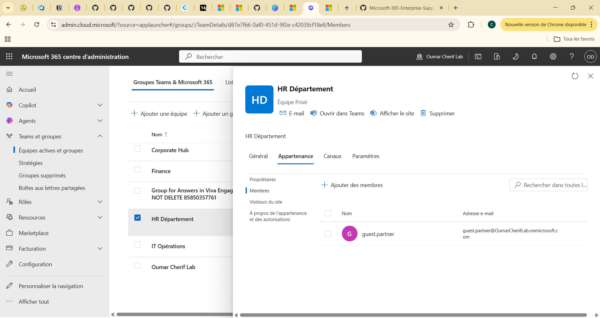
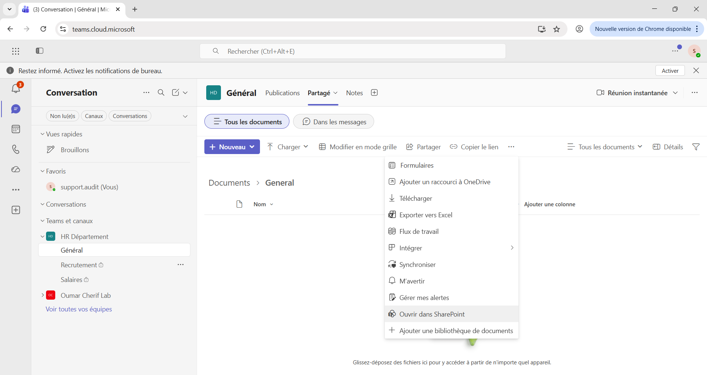
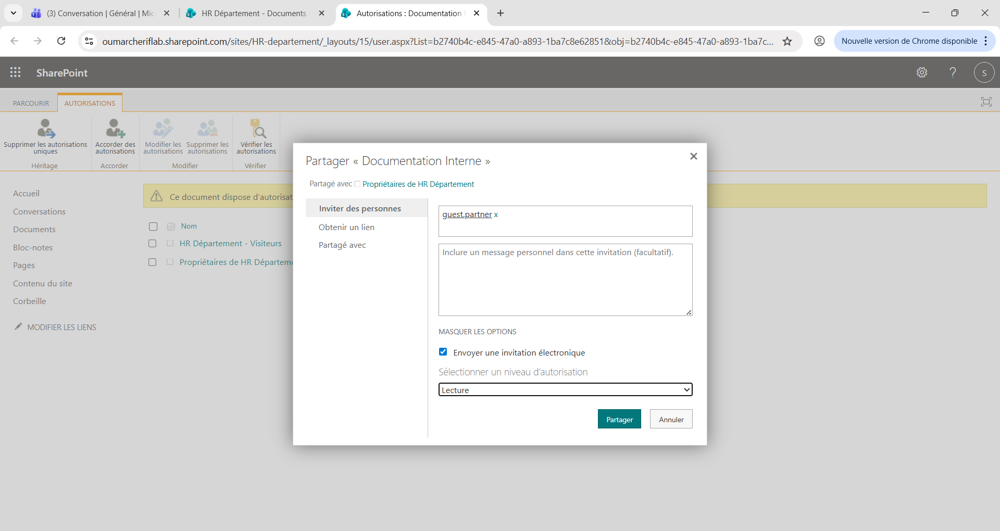
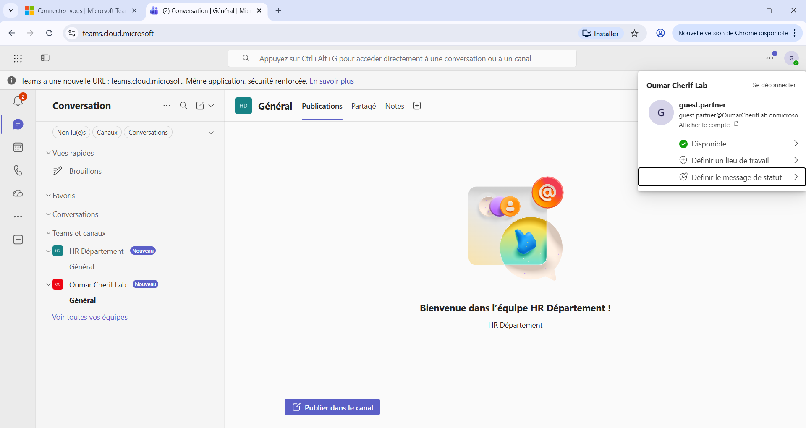
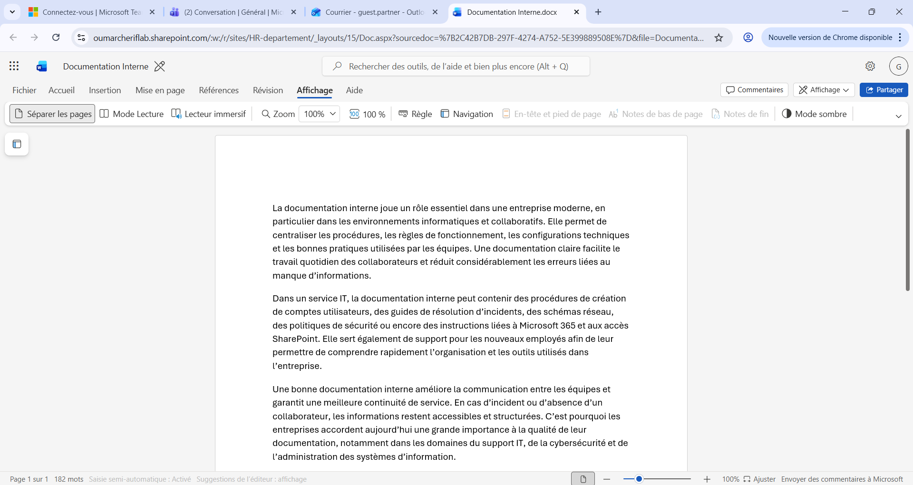

# SharePoint – Lecture seule

## Objectif
Donner un accès lecture seule à un utilisateur invité sur un document SharePoint.

---

## Étapes

### 1. Ajout de l’utilisateur invité
`guest.partner` ajouté dans l’équipe HR Département.

---

### 2. Ouverture du site SharePoint depuis Teams

---

### 3. Attribution de la permission Lecture

---

### 4. Connexion avec le compte invité

---

### 5. Validation finale
Le document est accessible uniquement en lecture.

---

## Compétences travaillées

- SharePoint Online
- Microsoft Teams
- Gestion des permissions
- Accès invité Microsoft 365
