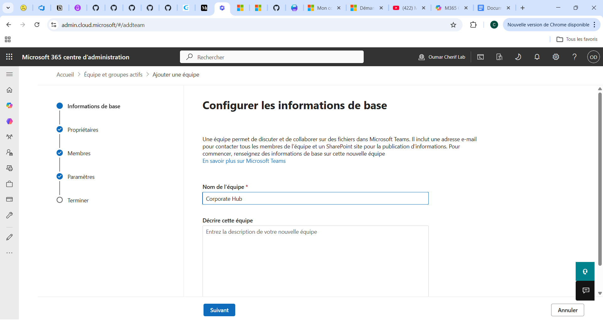
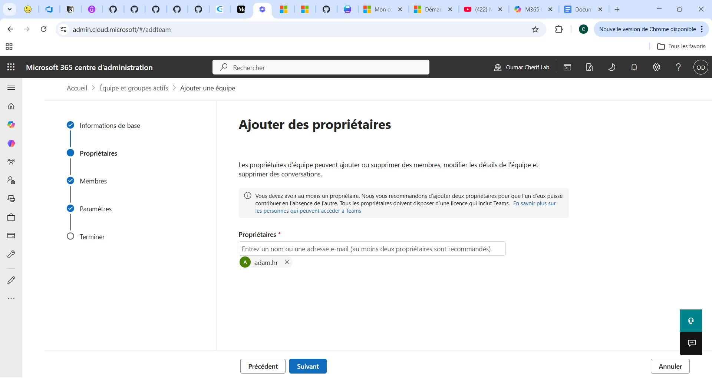
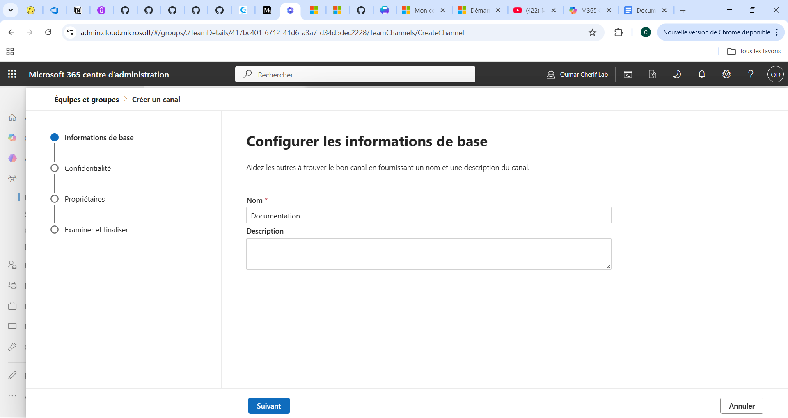
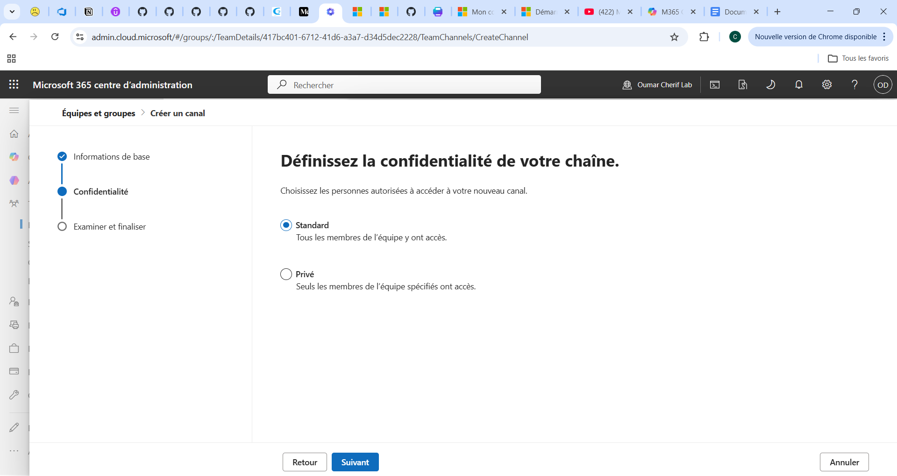

# Équipes Microsoft Teams et canaux

## Objectif

Simuler plusieurs départements d’entreprise dans Microsoft Teams afin de reproduire une organisation Microsoft 365 réaliste.

---

# Équipes créées

## 1. Corporate Hub
Canaux :
- Général
- Documentation
- Annonces

---

## 2. HR Department

Canaux :
- Général
- Recrutement (privé)
- Salaires (privé)

---

## 3. IT Operations

Canaux :
- Support-N1
- Incidents
- Infrastructure
- Accès-Sensibles (privé)

---

## 4. Finance

Canaux :
- Général
- Facturation
- Budgets
- Rapports-financiers (privé)

---

# Compétences travaillées

- Création d’équipes Microsoft Teams
- Gestion des canaux standards et privés
- Gestion des membres et propriétaires
- Permissions et confidentialité
- Collaboration Teams / SharePoint
- Organisation documentaire
